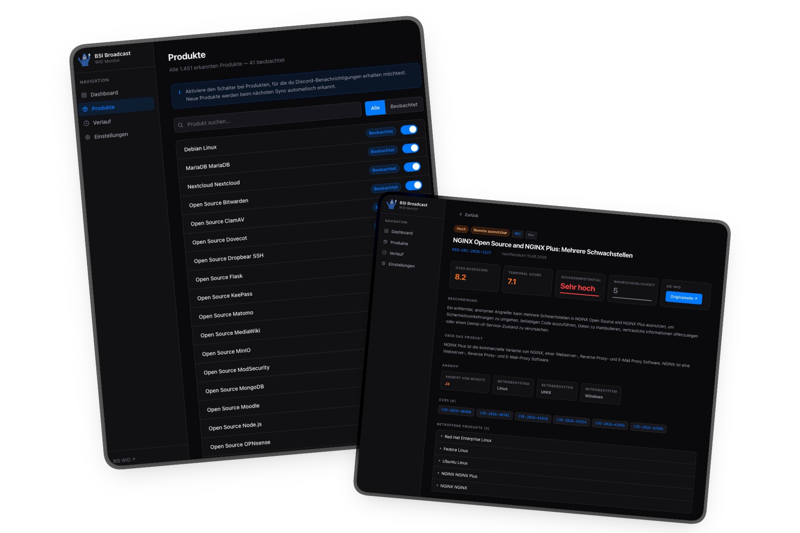
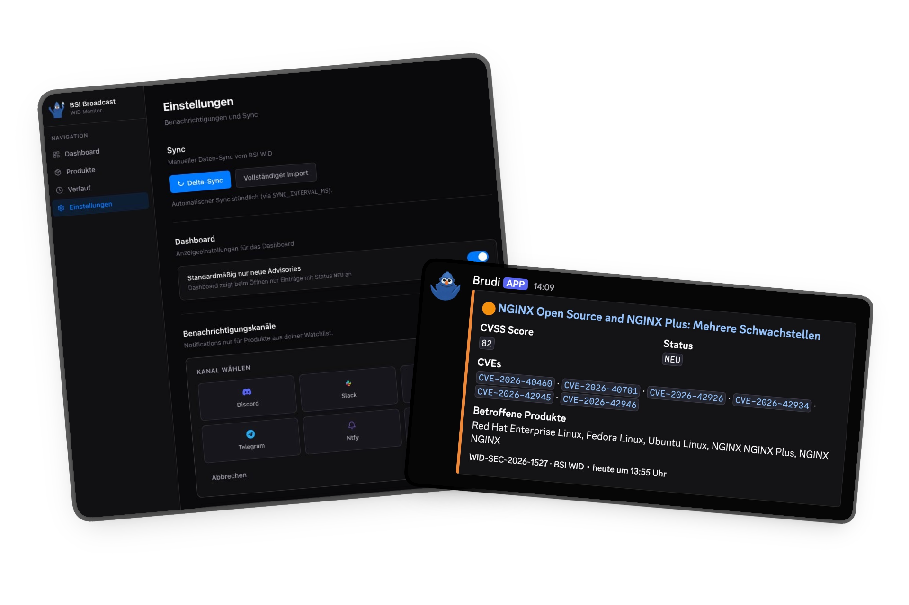

<div align="center">
  
  <h1>BSI Broadcast</h1>
  <p><strong>Self-hosted security advisory monitoring for the German BSI WID feed.</strong></p>
  <p>Track new advisories, watch affected products, and route relevant alerts to the channels your team already uses.</p>
  <p>
    
    
    
    
  </p>
</div>

---

BSI Broadcast turns the public [BSI WID](https://wid.cert-bund.de) security advisory feed into a small, self-hosted operations tool. It imports advisories into a local SQLite database, keeps them up to date, enriches detail pages with CVEs, CVSS scores and references, and can notify you when products you care about are mentioned.

It is built for people who want a simple internal dashboard instead of manually checking the WID portal: small IT teams, homelabs, MSPs, admins, security-minded developers, and anyone who wants BSI advisories in their own stack.

## Preview

<p align="center">
  <a href=".github/media/screens1.png">
    
  </a>
  <a href=".github/media/screens2.png">
    
  </a>
</p>

## What It Does

- **Monitors BSI WID advisories** with automatic initial import and recurring delta syncs.
- **Shows a focused dashboard** with severity cards, search, filters, pagination and current sync state.
- **Enriches advisory detail pages** with descriptions, CVEs, CVSS scores, revision history, affected products and external references.
- **Maintains a product watchlist** so notifications can focus on the systems you actually care about.
- **Sends alerts to common channels** including Discord, Slack, Microsoft Teams, Telegram, Ntfy and generic webhooks.
- **Supports severity thresholds per channel**, for example only critical issues to an emergency channel and everything else to a team channel.
- **Runs with SQLite**, so there is no external database to manage and backups are just a file.

## Why Self-Host It

- You keep advisory data, watchlists and notification targets under your control.
- It works well on a small VPS, NAS, homelab server or internal Docker host.
- The app is intentionally boring operational software: persistent data volume, healthcheck, no required SaaS backend.
- You can pin Docker image versions instead of trusting a moving `latest` tag.

## Quick Start

```yaml
# docker-compose.yml
services:
  bsibroadcast:
    image: ghcr.io/wiesty/bsibroadcast:latest
    ports:
      - "3000:3000"
    volumes:
      - ./data:/app/data
    restart: unless-stopped
```

```bash
docker compose up -d
```

Open [http://localhost:3000](http://localhost:3000). On first start the app imports all BSI advisories automatically (~2–3 minutes, rate-limited to 1 page/second out of respect for the BSI API).

## Configuration

| Variable | Default | Description |
|---|---|---|
| `PUID` | `1001` | User ID the process runs as. Set this to your host user ID when mounting `./data`. |
| `PGID` | `1001` | Group ID the process runs as. |
| `DB_PATH` | `/app/data/bsibroadcast.db` | Path to the SQLite database file. |
| `SYNC_INTERVAL_MS` | `3600000` | Delta sync interval in milliseconds. Default: 1 hour. |

## Notifications

Configure channels in **Einstellungen → Benachrichtigungskanäle**.

| Channel | What you need |
|---|---|
| Discord | Webhook URL |
| Slack | Incoming Webhook URL |
| Microsoft Teams | Incoming Webhook URL |
| Telegram | Bot Token + Chat ID |
| Ntfy | Server URL + Topic, optional token |
| Generic Webhook | URL, method, optional headers as JSON |

Each channel can have its own minimum severity. That makes it easy to keep high-noise feeds out of urgent channels while still logging lower-severity advisories somewhere useful.

## Images And Releases

Docker images are published to `ghcr.io/wiesty/bsibroadcast`.

- `latest` points at the newest stable release.
- Versioned releases are tagged as `vX.Y.Z`, `X.Y.Z`, `X.Y`, `X` and `sha-*`.
- For production-like deployments, prefer a pinned version tag such as `ghcr.io/wiesty/bsibroadcast:v0.1.1`.
- The app displays its current version in the sidebar footer and can check GitHub for newer releases.

## Development

**Requirements:** Node 22+

```bash
git clone https://github.com/wiesty/bsibroadcast
cd bsibroadcast
npm install

# local database
echo "DB_PATH=./data/dev.db" > .env.local
mkdir -p data

npm run dev
```

Open [http://localhost:3000](http://localhost:3000).

Useful commands:

```bash
npm run lint
npm run build
```

## Release Flow

`package.json` is the source of truth for the app version. Creating a `vX.Y.Z` tag triggers the Docker build workflow.

```bash
npm version patch   # or minor / major
git push origin main --tags
```

You can also run **GitHub Actions → Docker Build & Push → Run workflow** manually and pass a version such as `v1.2.3`.

## Tech Stack

- [Next.js 16](https://nextjs.org) — App Router, Server Components, Route Handlers
- [Drizzle ORM](https://orm.drizzle.team) + [better-sqlite3](https://github.com/WiseLibs/better-sqlite3)
- [Tailwind CSS v4](https://tailwindcss.com)
- [Lucide React](https://lucide.dev)

## License

MIT
